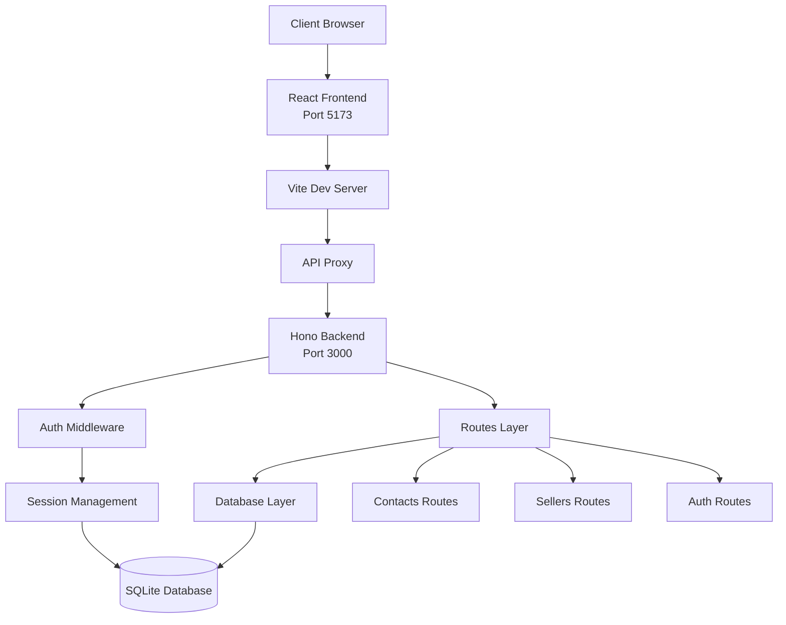

# KeepWarm CRM

## Purpose

KeepWarm CRM is a customer relationship management system designed for managing contacts and sellers with role-based access control. The system allows sellers to manage their own contacts while administrators can manage all contacts and sellers. It provides a RESTful API backend with a modern React frontend for a complete CRM solution.

## Structure

The project follows a monorepo structure with separate backend and frontend applications. The backend is built with Hono framework providing REST API endpoints, while the frontend is a React SPA using React Router for navigation. The backend uses SQLite database with Drizzle ORM for type-safe database operations, and implements session-based authentication with Bearer tokens.

## Components

**Backend Components:**
- **Authentication System**: Session-based auth with Argon2 password hashing, token generation, and middleware for protected routes
- **Contacts Management**: CRUD operations for contacts with seller-scoped access (sellers see only their contacts, admins see all)
- **Sellers Management**: Admin-only CRUD operations for managing seller accounts
- **Database Layer**: Drizzle ORM schema definitions for users, sessions, and contacts tables with proper relationships

**Frontend Components:**
- **Auth Context**: React context for managing authentication state and user session
- **Contact Pages**: List and form components for viewing and managing contacts
- **Seller Pages**: List and form components for admin-only seller management
- **API Client**: Centralized HTTP client with token management and error handling
- **UI Components**: Reusable components (Button, Card, Input, LoadingSpinner, etc.) built with Tailwind CSS

## Technical choices

- **Backend Framework**: Hono (lightweight, fast web framework)
- **Frontend Framework**: React 19 with React Router 7
- **Database**: SQLite with Better-SQLite3
- **ORM**: Drizzle ORM (type-safe SQL query builder)
- **Authentication**: Session-based with Argon2 password hashing
- **State Management**: React Query (TanStack Query) for server state
- **Styling**: Tailwind CSS 4
- **Build Tool**: Vite 6
- **Language**: TypeScript
- **Testing**: Vitest
- **Validation**: Zod

## Development environment

- **Node.js**: Required for running both backend and frontend
- **Backend Server**: Runs on port 3000 (configurable via PORT env var)
- **Frontend Dev Server**: Runs on port 5173 with Vite
- **Database**: SQLite database file created automatically on first run
- **Environment Variables**: 
  - `PORT`: Backend server port (default: 3000)
  - `SEED_DB`: Set to 'true' to seed database on startup
  - `NODE_ENV`: Set to 'production' to disable dev endpoints
  - `VITE_API_URL`: Frontend API base URL (defaults to empty for proxy)

## Tools and Packages

**Backend Dependencies:**
- `hono`: Web framework
- `@hono/node-server`: Node.js server adapter for Hono
- `@hono/zod-validator`: Request validation middleware
- `better-sqlite3`: SQLite database driver
- `drizzle-orm`: Type-safe ORM
- `@node-rs/argon2`: Password hashing
- `zod`: Schema validation

**Backend Dev Dependencies:**
- `tsx`: TypeScript execution
- `typescript`: TypeScript compiler
- `vitest`: Test framework
- `drizzle-kit`: Database migrations and introspection

**Frontend Dependencies:**
- `react`: React library
- `react-dom`: React DOM renderer
- `react-router-dom`: Client-side routing
- `@tanstack/react-query`: Server state management

**Frontend Dev Dependencies:**
- `vite`: Build tool and dev server
- `@vitejs/plugin-react`: React plugin for Vite
- `tailwindcss`: Utility-first CSS framework
- `@tailwindcss/vite`: Tailwind CSS Vite plugin
- `typescript`: TypeScript compiler
